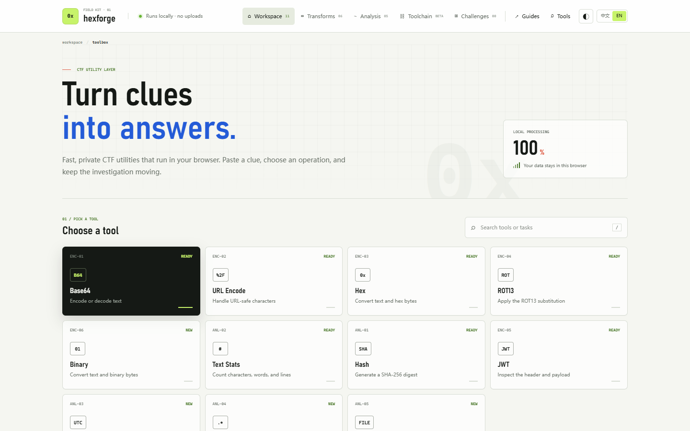
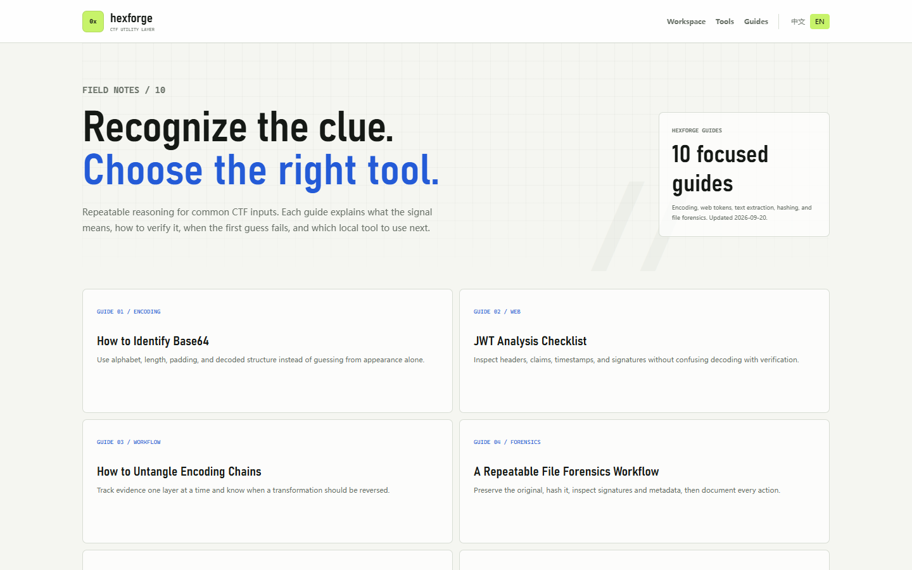

# Hexforge

**A local-first browser toolbox for CTF decoding, analysis, repeatable pipelines, and challenge notes.**

[Open Hexforge](https://hexforgectf.cn/) · [Browse the guides](https://hexforgectf.cn/en/guides/) · [Report an issue](https://github.com/chase-580/hexforge-ctf-toolbox/issues)



Hexforge keeps common CTF work in one focused interface. Text transformations, hashes, challenge records, and toolchain steps run in the browser so challenge data does not need to be pasted into a remote API.

## What is included

- 11 browser tools: Base64, URL encoding, hex, binary, ROT13, text statistics, SHA-256, JWT inspection, Unix timestamps, regex, and file SHA-256.
- A visual toolchain for combining up to eight reversible operations with an inspectable execution trace.
- A local challenge workspace for notes, flags, saved results, tags, attachments, and JSON backup.
- Dedicated English and Chinese tool pages with canonical URLs and language alternates.
- Ten original English field guides covering identification, verification, common errors, and practical CTF workflows.
- Safe tool links that identify the selected tool without including input, output, flags, or challenge data.



## Privacy model

Core transforms execute locally with browser APIs. Workspace records use `localStorage` and `IndexedDB` on the current device. Hexforge does not send tool input, output, notes, flags, or attachments to its server.

The public site uses Cloudflare Web Analytics and may use Google advertising services as described in the [privacy policy](https://hexforgectf.cn/en/privacy/). Those services measure visits and ad delivery; they are separate from tool content.

## Run locally

No build step or package installation is required. Serve the repository with any static web server:

```bash
python -m http.server 8765
```

Then open `http://127.0.0.1:8765/`. A web server is recommended because some browsers restrict Web Crypto and clipboard features on `file://` pages.

## Useful routes

| Route | Purpose |
| --- | --- |
| `/` | English workspace |
| `/en/` | English tool directory |
| `/en/guides/` | Practical English CTF guides |
| `/zh/workspace/` | Chinese workspace |
| `/zh/` | Chinese tool directory |
| `/sitemap.xml` | Search engine sitemap |

## Project structure

```text
index.html                 English workspace
app.js / toolchain.js      Workspace and pipeline logic
workspace.js               Local challenge records
en/tools/                  English tool pages
en/guides/                 English field guides
zh/                        Chinese workspace, tools, and guides
site.css / styles.css      Shared interface styles
analytics.js               Privacy-aware analytics bridge
```

## Roadmap

The current release establishes the free local toolbox and educational content. Planned work includes richer file workflows, reusable pipeline presets, optional account sync, and a paid membership for advanced productivity features. Core single-item transforms will remain useful without an account.

## Responsible use

Hexforge is designed for CTFs, training labs, your own systems, and other explicitly authorized work. It performs transformations and inspection in the browser; it is not an exploit runner or a substitute for permission.

Security issues can be reported privately through [GitHub Security Advisories](https://github.com/chase-580/hexforge-ctf-toolbox/security/advisories/new). Product feedback and reproducible bugs are welcome in [GitHub Issues](https://github.com/chase-580/hexforge-ctf-toolbox/issues).

## Contributing

Small, focused pull requests are preferred. Include a reproducible input and expected output for tool changes, and cite primary specifications when adding format-specific behavior. Do not include real credentials, private challenge material, or user data in issues or test fixtures.
